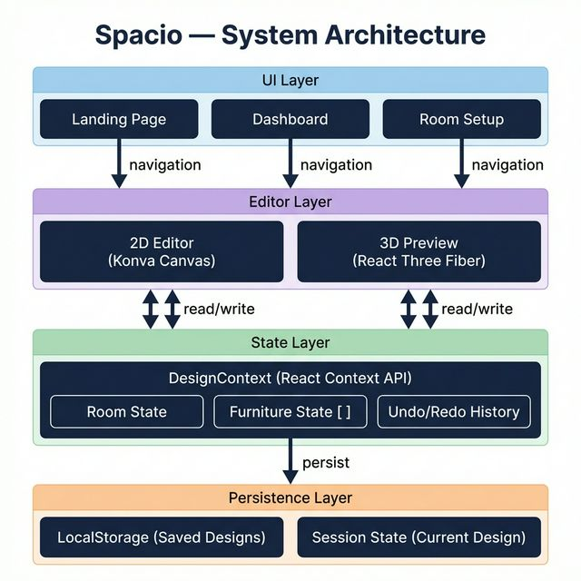
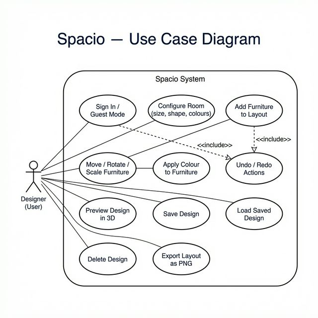
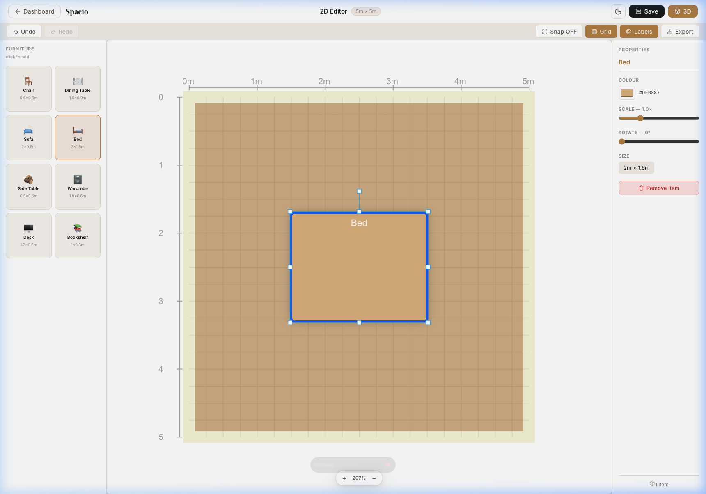
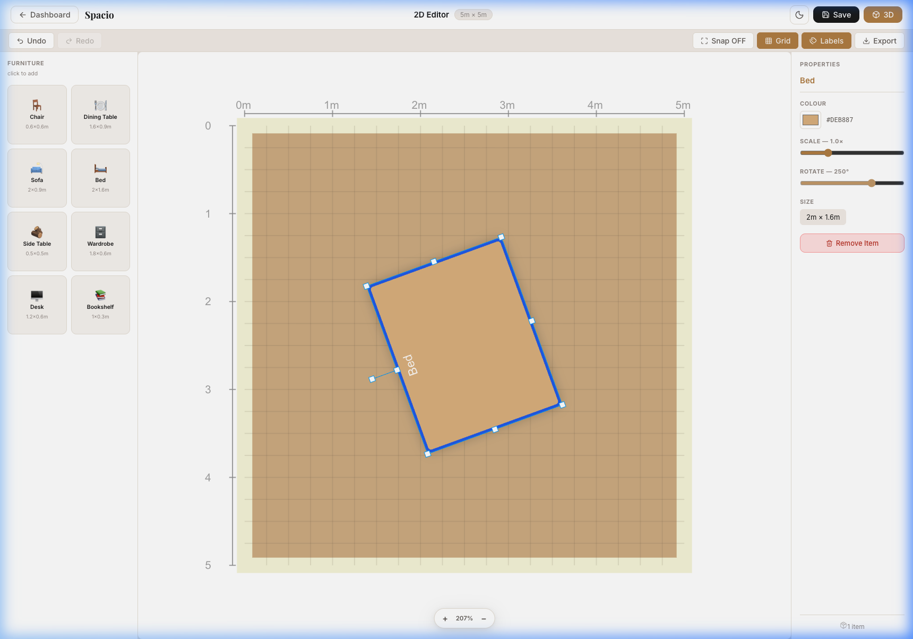
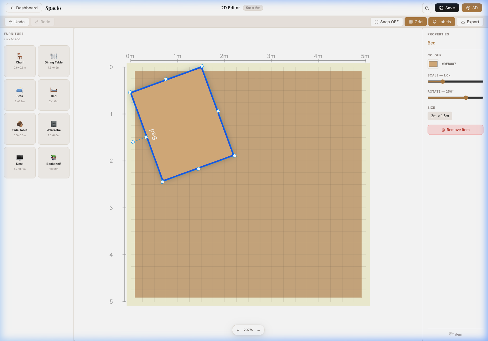
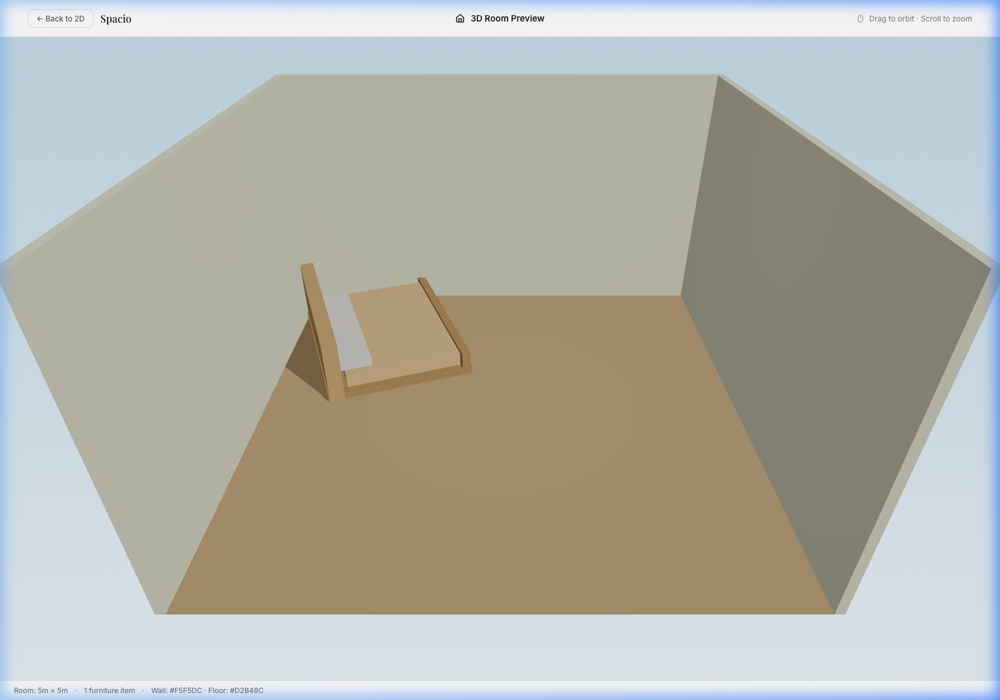
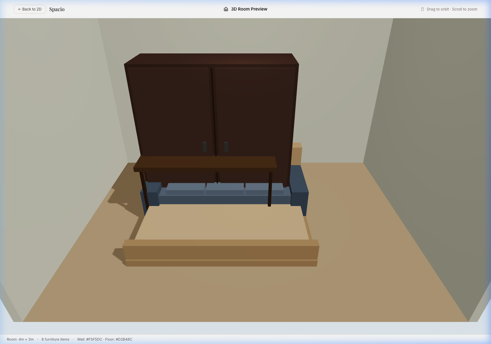

# Spacio — Furniture Planner: Report Documentation

> This document consolidates the system architecture, requirements, use case diagram, test plan, and verification & validation evidence for use in the project report.

---

## 1. System Architecture

Spacio is built as a four-layer React web application. Each layer has a single, well-defined responsibility.



| Layer | Technology | Responsibility |
|---|---|---|
| **UI Layer** | React + React Router DOM | Page routing, navigation, authentication modal |
| **Editor Layer** | Konva (2D), React Three Fiber (3D) | Interactive canvas rendering, geometry, input handling |
| **State Layer** | React Context API (`DesignContext`) | Global state: room config, furniture list, undo/redo history |
| **Persistence Layer** | Browser `localStorage` | Saving and loading named designs across sessions |

### Data Flow

```
User Action (UI Layer)
       │
       ▼
DesignContext.updateFurniture() / addFurniture() / setRoom()
       │ (state update triggers re-render)
       ▼
Konva Canvas (2D) ◄──────────────────────────────────► React Three Fiber (3D)
       │                                                       │
       └──────────────────────────────────────────────────────┘
                              │
                              ▼
                     localStorage.setItem()
                    (on saveDesign() call)
```

---

## 2. Use Case Diagram



### Actors
- **Designer (User)** — the primary actor. A professional or hobbyist using Spacio to design a room layout.

### Use Cases Summary

| Use Case | Description |
|---|---|
| Sign In / Guest Mode | Authenticate or enter the app without an account |
| Configure Room | Set dimensions (1–20m), shape (Rectangle/Square/L-Shape), wall and floor colours |
| Add Furniture to Layout | Click a furniture type from the library to place it centred on the floor |
| Move / Rotate / Scale Furniture | Drag to reposition; rotation slider or handles to rotate around visual centre; scale slider to resize |
| Apply Colour to Furniture | colour picker in Properties panel changes individual item colour |
| Undo / Redo Actions | Ctrl+Z / Ctrl+Y reverses or replays the last state change |
| Preview Design in 3D | Navigate to the 3D Preview which renders room and furniture using React Three Fiber |
| Save Design | Provide a name; design is serialised to localStorage |
| Load Saved Design | Dashboard card re-hydrates state from localStorage |
| Delete Design | Premium confirmation modal then removes the design |
| Export Layout as PNG | Konva's `toDataURL()` exports the current canvas as a PNG download |

---

## 3. Requirements Traceability

### Functional Requirements

| # | Requirement | Implemented Feature | Status |
|---|---|---|---|
| FR1 | Enter and store room specifications (size, shape, colour scheme) | Room Setup page with live preview; stored in `DesignContext.room` | ✅ |
| FR2 | Create new designs based on room specs and visualise in 2D | Full Konva 2D editor with floor plan, grid, rulers | ✅ |
| FR3 | Convert designs into 3D views for realistic presentation | React Three Fiber 3D preview with procedural furniture geometry | ✅ |
| FR4 | Scale furniture items to fit room dimensions | Scale slider (0.5×–2.5×) + canvas Transform handles | ✅ |
| FR5 | Apply shading to entire design or selected furniture pieces | Hemisphere light + directional light in 3D; per-item colour in 2D | ✅ |
| FR6 | Change colours for entire design or selected furniture pieces | Wall/floor colour pickers in Room Setup; per-item colour picker in Editor | ✅ |
| FR7 | Save completed designs for future use | Save modal → `localStorage.setItem()`; Dashboard shows saved cards | ✅ |
| FR8 | Edit or delete existing designs | Dashboard: open (loads state) / delete (confirmation modal + removal) | ✅ |

### Non-Functional Requirements

| # | Requirement | How Addressed | Status |
|---|---|---|---|
| NFR1 | **Usability** — intuitive, consistent, minimal training | Unified Navbar on all pages; consistent button classes; onboarding on Landing | ✅ |
| NFR2 | **Performance** — render in 2D and 3D without noticeable delay | Vite build tool; Konva hardware-accelerated canvas; Three.js GPU rendering | ✅ |
| NFR3 | **Accessibility** — colour contrast, font size, navigation | Dark mode with boosted contrast; 500-weight fonts; keyboard shortcuts | ✅ |
| NFR4 | **Feedback** — immediate confirmation of actions | Save modal confirms; delete modal confirms; property panel updates live | ✅ |
| NFR5 | **Error Prevention & Recovery** — undo options | Full Ctrl+Z/Ctrl+Y undo/redo; boundary clamping prevents invalid placement | ✅ |
| NFR6 | **Efficiency** — complete tasks with minimal steps | 3 clicks from Landing → design (Guest Mode → Room Setup → Editor) | ✅ |
| NFR7 | **Engagement** — 3D visualisation visually appealing | Procedural 3D furniture with multi-part geometry; hemisphere + directional lighting | ✅ |

---

## 4. Test Plan

### Testing Strategy

| Type | Method |
|---|---|
| **Functional Testing** | Manual black-box testing against each use case |
| **Boundary Testing** | Edge values for room dimensions (min/max) and furniture placement limits |
| **UI/UX Testing** | Visual inspection of dark/light modes, hover states, responsive layout |
| **Integration Testing** | Verify 2D editor state is correctly reflected in 3D Preview |
| **Regression Testing** | Re-test after each bug fix to confirm no new issues introduced |

---

### Test Cases

#### Module 1 — Authentication

| TC# | Test Case | Precondition | Steps | Expected Result | Status |
|---|---|---|---|---|---|
| TC-01 | Sign in with valid credentials | App loaded at `/` | 1. Click "Start Designing" 2. Enter `designer` / `furniture123` 3. Click "Log In" | Redirects to Dashboard; Navbar shows "My Designs" and "Sign Out" | ✅ Pass |
| TC-02 | Continue as Guest | App loaded at `/` | 1. Click "Start Designing" 2. Click "Continue as Guest (Demo Mode)" | Redirects to Room Setup; no persistent account | ✅ Pass |
| TC-03 | Invalid login attempt | App loaded at `/` | 1. Enter wrong username/password 2. Click "Log In" | Error message displayed; user remains on modal | ✅ Pass |

#### Module 2 — Room Setup

| TC# | Test Case | Precondition | Steps | Expected Result | Status |
|---|---|---|---|---|---|
| TC-04 | Configure rectangular room | Logged in or guest | 1. Set width=4, length=3 2. Select Rectangle 3. Choose wall & floor colours 4. Click "Continue" | Editor opens with correct 4×3m room, matching colours | ✅ Pass |
| TC-05 | Configure L-Shape room | Logged in or guest | 1. Set width=6, length=5 2. Select L-Shape 3. Click "Continue" | 2D editor shows L-Shape floor plan correctly; 3D renders L-Shape | ✅ Pass |
| TC-06 | Minimum room size boundary | Room Setup open | 1. Set width=1, length=1 2. Click "Continue" | Editor opens with 1×1m room plan; no crash | ✅ Pass |
| TC-07 | Maximum room size boundary | Room Setup open | 1. Set width=20, length=20 2. Click "Continue" | Editor opens with 20×20m room; scroll/zoom functions correctly | ✅ Pass |

#### Module 3 — 2D Editor

| TC# | Test Case | Precondition | Steps | Expected Result | Status |
|---|---|---|---|---|---|
| TC-08 | Add furniture to floor | 4×3m room in Editor | 1. Click "Bed" in furniture library | Bed appears **centred on the floor** (not on wall/padding area) | ✅ Pass |
| TC-09 | Rotate furniture in place | Bed added and selected | 1. Drag Rotate slider from 0° to 90° | Bed rotates **around its visual centre** without jumping to new position | ✅ Pass |
| TC-10 | Floor boundary clamping | Bed placed in centre | 1. Drag bed to far corner | Bed stops at the floor boundary; cannot be placed in wall/padding area | ✅ Pass |
| TC-11 | Undo / Redo | Two furniture items added | 1. Press Ctrl+Z | Last added item removed. 2. Press Ctrl+Y → item restored | ✅ Pass |
| TC-12 | Change furniture colour | Chair added and selected | 1. Click colour picker 2. Select red (#FF0000) | Chair colour updates immediately on the canvas | ✅ Pass |
| TC-13 | Delete via keyboard | Item selected | 1. Press Delete key | Item removed from canvas; undo restores it | ✅ Pass |
| TC-14 | Scale furniture | Sofa selected | 1. Drag Scale slider to 2.0× | Sofa visually doubles in size; remains within floor boundary | ✅ Pass |
| TC-15 | Export PNG | Layout with furniture | 1. Click "Export" button | PNG file downloaded containing the current canvas view | ✅ Pass |

#### Module 4 — 3D Preview

| TC# | Test Case | Precondition | Steps | Expected Result | Status |
|---|---|---|---|---|---|
| TC-16 | 2D→3D position accuracy | Bed placed at top-left of floor | 1. Click "3D" button | In 3D view, Bed appears at the corresponding top-left position of the room floor | ✅ Pass |
| TC-17 | 3D furniture distinct shapes | All 8 furniture types added | 1. Click "3D" | Each type renders as its procedural geometry (Wardrobe has doors, Bed has headboard, Bookshelf has shelves) | ✅ Pass |
| TC-18 | Orbit controls | 3D Preview open | 1. Click and drag on scene | Camera orbits the room; polar angle limited to not go below floor | ✅ Pass |

#### Module 5 — Design Persistence

| TC# | Test Case | Precondition | Steps | Expected Result | Status |
|---|---|---|---|---|---|
| TC-19 | Save design | Logged in; 3 items on canvas | 1. Click Save 2. Enter name "Bedroom" 3. Click Confirm | Toast/modal confirms save; Dashboard shows "Bedroom" card | ✅ Pass |
| TC-20 | Load saved design | "Bedroom" design saved | 1. Go to Dashboard 2. Click "Bedroom" card | Editor opens with correct room and furniture restored | ✅ Pass |
| TC-21 | Delete saved design | "Bedroom" design saved | 1. Click delete on "Bedroom" 2. Confirm in modal | Card removed from Dashboard; design no longer in localStorage | ✅ Pass |

---

## 5. Verification & Validation (V&V) Evidence

### V&V Approach

**Verification** answers: *"Did we build the system right?"*
- Code review of each component against its specification
- Checking that `DesignContext` correctly propagates state to both the 2D and 3D renderers

**Validation** answers: *"Did we build the right system?"*
- End-to-end testing of complete user journeys (design → save → reload)
- Checking that the 3D preview matches the 2D layout

### Evidence Screenshots

#### TC-08: Furniture spawns at floor centre (not wall area)


> **Verified:** The Bed appears centred within the brown floor area, not in the cream/white wall padding.

---

#### TC-09: Rotation in place (centre pivot)


> **Verified:** The Bed rotates around its visual centre at 250°. The piece does not jump to a different location.

---

#### TC-10: Floor boundary clamping


> **Verified:** When dragged to the top-left corner, the rotated Bed is clamped to the floor boundary. No part of the item overlaps the cream wall/padding area.

---

#### TC-16 + TC-17: 3D Preview — correct position & distinct shape


> **Verified:** The Bed's 3D position matches the 2D canvas coordinates. The procedural Bed geometry (headboard + mattress + pillows + footboard) is clearly visible and distinct from the walls and floor.

---

#### TC-17: All 8 furniture types with distinct 3D shapes


> **Verified:** The Wardrobe (door panels + handles), Dining Table (legs + flat top), Sofa (armrests + cushions), and Bed (headboard + mattress) are all visually distinct — not plain boxes.

---

## 6. Innovation Justification

### Why Konva for 2D?

Konva is a high-performance 2D canvas library built on HTML5 Canvas. Unlike SVG-based alternatives (e.g., D3, React Flow), Konva renders using the GPU-accelerated Canvas API, giving smooth drag performance even with many items. It also provides a React-friendly declarative API through `react-konva`, making state-driven re-renders straightforward.

### Why React Three Fiber + Three.js for 3D?

Three.js is the industry-standard WebGL 3D library. React Three Fiber provides a declarative React interface, meaning the 3D scene is driven by the same React state as the rest of the app — no manual Three.js scene graph management required. This allows the 2D design state in `DesignContext` to be mapped directly to 3D world coordinates, ensuring perfect consistency between the 2D editor and 3D preview.

### Why Procedural Geometry Instead of GLB Models?

Procedural geometry (constructing furniture from primitive `boxGeometry` shapes in Three.js) was chosen over loading `.glb` files for three reasons:
1. **Zero external dependencies** — no model hosting, no async loading, no network requests
2. **Colour inheritance** — procedural meshes render in the exact colour chosen in the 2D editor, including automatic tonal variation using the `shadeColor` utility
3. **Scale invariance** — geometry scales correctly at any dimension since it's computed from `item.width × item.scale` at render time

### Why React Context API Instead of Redux?

For this project's scope, React Context API provides sufficient state management without the boilerplate overhead of Redux. The undo/redo history is implemented as an immutable snapshot array (`historyRef`) with a current index pointer, giving full time-travel debugging without a third-party state manager.

---

## 7. Identified Limitations and Future Work

| Limitation | Description | Proposed Solution |
|---|---|---|
| Canvas resize not state-persistent | Drag-handle resizing in Konva Transformer updates visual size but not saved `scale` | Already partially fixed with `onTransformEnd`; full persistence in next iteration |
| No real authentication backend | Credentials are hardcoded client-side | Integrate Firebase Auth or a Node.js/JWT backend |
| Procedural 3D geometry | Furniture shapes are approximate, not photorealistic | Replace with `.glb` models from Poly Haven or Sketchfab for selected types |
| No mobile touch support | The Konva canvas is not optimised for small screens | Add touch-event handling and a responsive breakpoint layout |
| Designs stored in localStorage | Designs are local to one browser/device | Add cloud sync via Firestore or similar |
