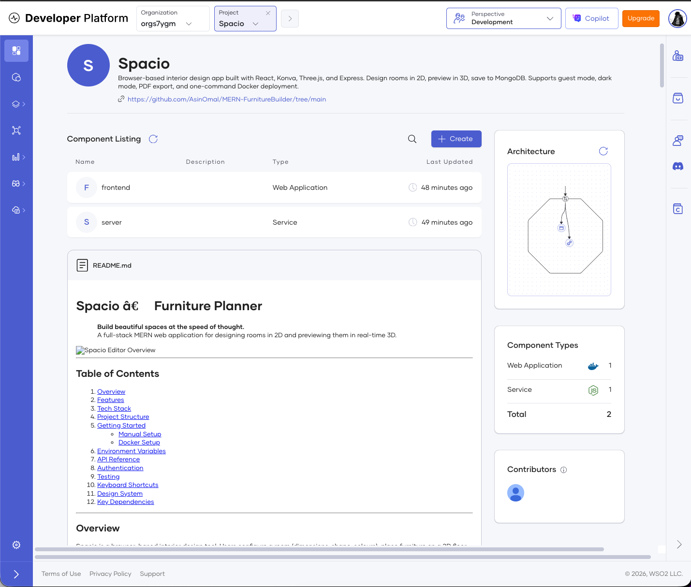
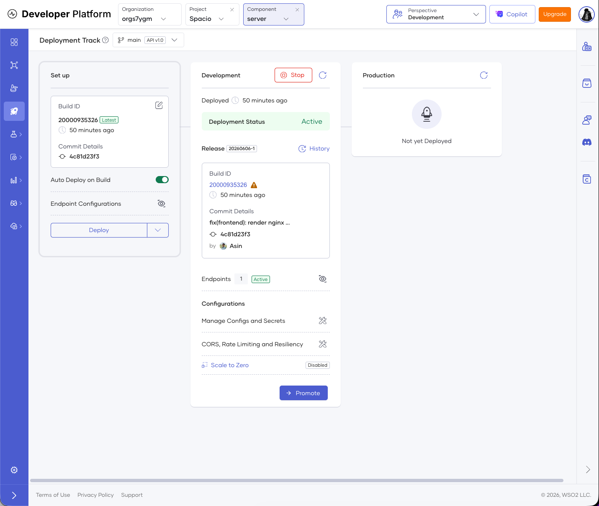
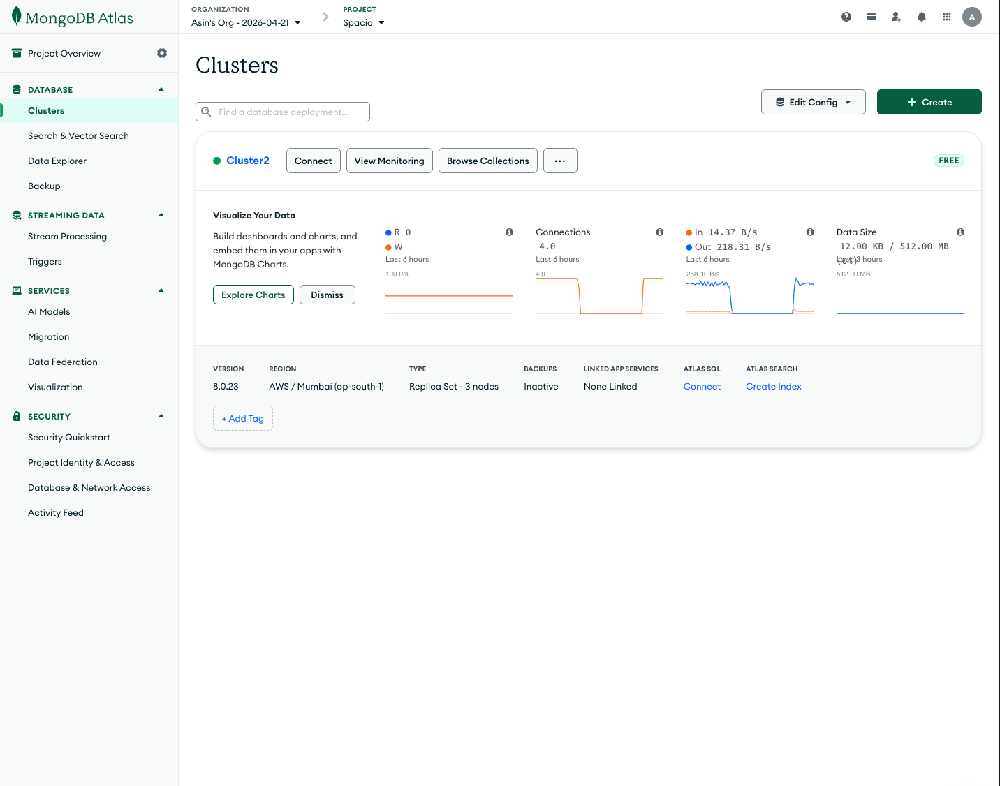
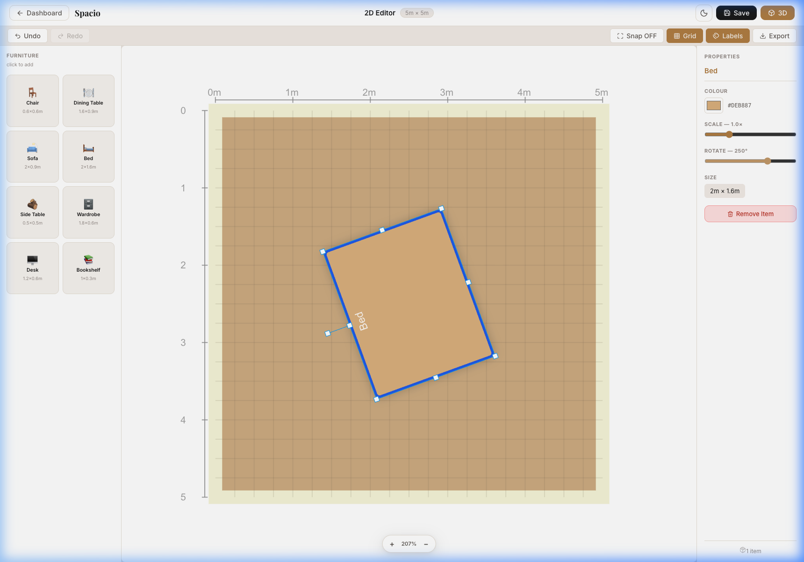
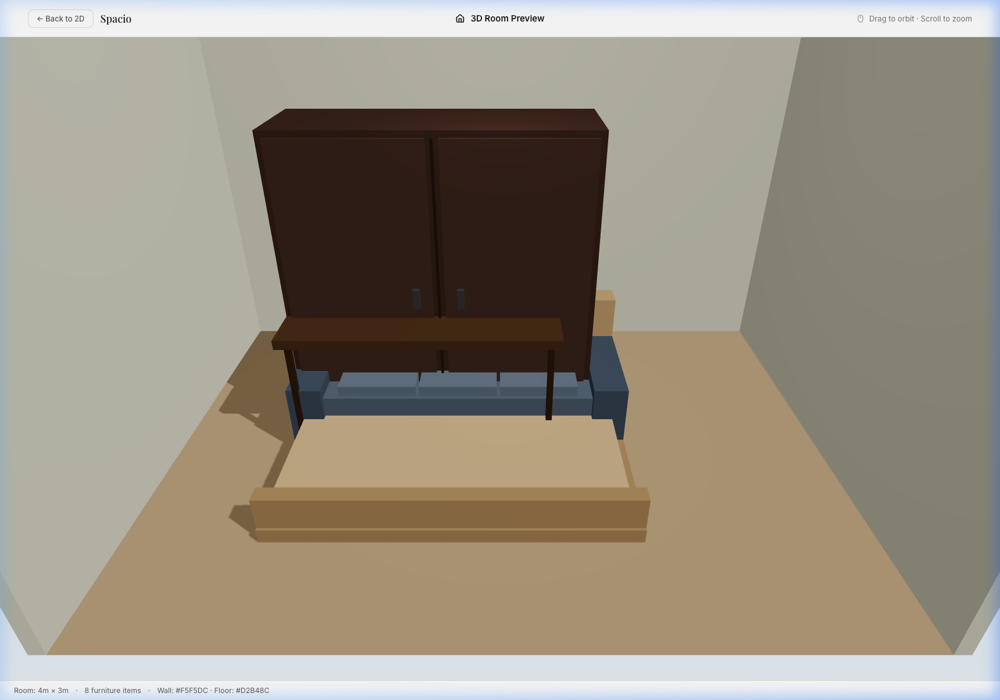

# Spacio — WSO2 Product Use

A full-stack **MERN furniture planner**: configure a room, lay out furniture on a
2D canvas with smart snapping and auto-arrange, then preview the result in **live
3D**. Designs persist to MongoDB per authenticated user, with dual-token JWT auth.

🔗 **Live app:** https://a32baadb-c3bf-487e-9343-dd27da91fc2c.e1-us-east-azure.choreoapps.dev

> This document explains **which WSO2 product the project uses and what it does in
> the app** — it is intentionally separate from the repo `README.md`, which covers
> how to develop the codebase.

---

## WSO2 Products Used

### Choreo — Build & Deployment Platform

The entire application runs on **WSO2 Choreo**, deployed as **two components**
wired to this GitHub repo. Choreo builds each component from its own Dockerfile,
runs security scans on the image, and hosts them behind a managed gateway with
automatic TLS.

**1. Backend — Service Component (Node.js + Express)**
- Choreo reads [`server/.choreo/component.yaml`](server/.choreo/component.yaml)
  to expose the REST API as a **Public** endpoint.
- The base path is set to `/` (not `/api`) because the Express app already
  namespaces its own routes under `/api` and `/uploads` — a `/api` base path
  would double them into `/api/api/...`.
- Secrets (`MONGODB_URI`, `JWT_SECRET`, `JWT_REFRESH_SECRET`) and `PORT` are
  injected through Choreo's **Configs & Secrets**, never committed to the repo.
  The backend fails fast on startup if any secret is missing or insecure.
- Health is observable through a DB-aware readiness probe at `/api/health`,
  which returns `{ "status": "ok", "db": "connected" }`.

**2. Frontend — Web Application Component (React build served by Nginx)**
- The React/Vite build is served by an **unprivileged Nginx** image.
- Nginx **reverse-proxies** `/api` and `/uploads` to the backend Service
  component. Because the SPA and the API are served from the **same origin**,
  relative API calls work and the **httpOnly `sameSite=strict` refresh cookie**
  keeps working with **no CORS** needed.
- The backend URL the proxy targets is baked in at **build time** — Choreo Web
  Application components don't expose runtime environment variables, and the
  container runs on a **read-only root filesystem**, so the Nginx config is
  rendered during the Docker build rather than at startup.

**Why Choreo (the deployment story):** connecting GitHub → Choreo means every
push can be built, security-scanned, and deployed without managing any servers,
TLS certificates, or container orchestration by hand. The live link below is what
makes the full 2D-editor → 3D-preview flow viewable in production.

> **Note:** the live app runs on Choreo's free tier, which scales to zero when
> idle. The first request after a period of inactivity may take **~30 seconds**
> to cold-start — give it a moment if the page or login feels slow on first load.

---

## Tech Stack

MongoDB Atlas · Express · React 19 · Node.js · Vite · Konva (2D canvas) ·
Three.js / React Three Fiber (3D) · Dual-token JWT auth · Docker · Nginx ·
**WSO2 Choreo**

---

## Architecture at a Glance

```
Browser ──HTTPS──►  Choreo Gateway
                         │
              ┌──────────┴───────────┐
              ▼                      ▼
   Web App Component          Service Component
   (Nginx + React build)      (Node + Express API)
        │  proxies /api ─────────►  │
        │  proxies /uploads ─────►  │
                                    ▼
                            MongoDB Atlas (M0)
```

Same-origin design: the SPA never calls the backend's URL directly — Nginx
forwards `/api` server-side, so the auth cookie stays first-party.

---

## Screenshots

**Choreo — two components deployed from this repo**



**Choreo — backend Service build & deploy (Active)**



**MongoDB Atlas — cluster backing the app**



**App — 2D editor**



**App — live 3D preview**



---

## What I Learned

Deploying a real MERN stack to Choreo surfaced a set of production-container
lessons that don't show up in local `npm run dev`:

- **Container hardening is enforced, not optional.** Choreo rejects root
  containers (`CKV_DOCKER_3`) and requires the runtime UID to sit in the
  `[10000, 20000]` range (`CKV_CHOREO_1`). I switched to the
  `nginx-unprivileged` image and set `USER 10001`. A non-root user can't bind
  port 80, so Nginx listens on **8080** instead.
- **Read-only root filesystem changes how you configure things.** The container
  can't write to `/etc/nginx` at runtime, so I render the Nginx config with
  `envsubst` **at build time** and point every Nginx scratch path
  (`proxy_temp_path`, `client_body_temp_path`, …) at **`/tmp`**, the one
  writable location. This was the single trickiest fix in the whole deploy.
- **The platform shapes your routing.** Choreo **injects `PORT`** and
  **prepends the endpoint base path** to incoming requests. Setting the base
  path to `/` (instead of `/api`) was what stopped requests from doubling into
  `/api/api/health`.
- **Secrets belong in the platform, validated on boot.** Moving all secrets into
  Choreo's Configs & Secrets — and making the backend **fail fast** if any are
  missing, insecure, or identical — caught a real misconfiguration early
  (a `MONGODB_URL` vs `MONGODB_URI` typo, and missing JWT secrets) instead of
  letting the app limp along in a broken state.
- **Same-origin beats CORS for cookie auth.** Rather than enabling CORS and
  switching the refresh cookie to `sameSite=none`, proxying `/api` through the
  frontend's Nginx kept the cookie `sameSite=strict` and first-party — simpler
  and more secure.
- **MongoDB Atlas networking matters too.** The free **M0** cluster needs the
  database user privileges and an **IP access list** entry before Choreo can
  connect over the SRV connection string.

Most of these I only hit once the app left my laptop. Local dev never cares
about UID ranges, read-only filesystems, or how a gateway rewrites your paths —
the deploy did, and sorting all of that out taught me more than the build itself.

---

## Running Locally

See [`README.md`](README.md) for full developer setup. In short:

```bash
# Frontend (repo root) — Vite dev server on :5173
npm install
npm run dev

# Backend (server/) — Express API on :5005
cd server
npm install
npm run dev
```

Or run the whole stack (Mongo + backend + Nginx-served frontend) with Docker:

```bash
docker compose up --build -d   # frontend on :80
```

---

<!-- If this was a group submission, keep the line below; otherwise delete it. -->
<!-- _Group project — my contribution: <describe your part>._ -->

_Built with the MERN stack and deployed on WSO2 Choreo._
